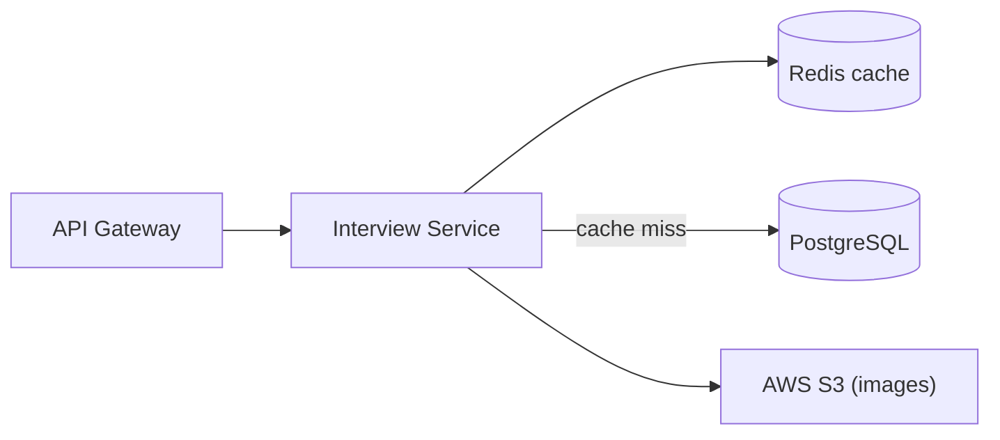

# 🎤 Switchboard — Interview Experience Service

Community-driven interview experience sharing. Users post their interview stories — company, role, difficulty, outcome — with optional image attachments stored in S3. Redis caches list queries for fast browsing; cache invalidates on every write.

`Java 17` `Spring Boot 3.5.5` `PostgreSQL` `Redis` `AWS S3`

## Architecture



## Key Decisions
| Decision | Choice | Why |
|---|---|---|
| Caching | Redis (Spring Cache) | List queries are read-heavy; cache cuts DB load significantly |
| Cache invalidation | On every write | Simple, correct; eventual consistency not needed here |
| Image storage | AWS S3 | Decoupled from DB, no blob storage pressure on Postgres |

## Endpoints
```
POST   /api/v1/interview/         create (multipart, optional image)
GET    /api/v1/interview/{id}     get by ID
GET    /api/v1/interview/user     my interviews
GET    /api/v1/interview/all      all (paginated)
GET    /api/v1/interview/filter   filter by company, role, outcome
PUT    /api/v1/interview/{id}     update
DELETE /api/v1/interview/{id}     delete
```

## Running
```bash
./mvnw spring-boot:run
# Needs: PostgreSQL, Redis, AWS S3
# Depends on: service-discovery :8761, config-server :8888
```
Swagger UI: `http://localhost:<port>/swagger-ui.html`
